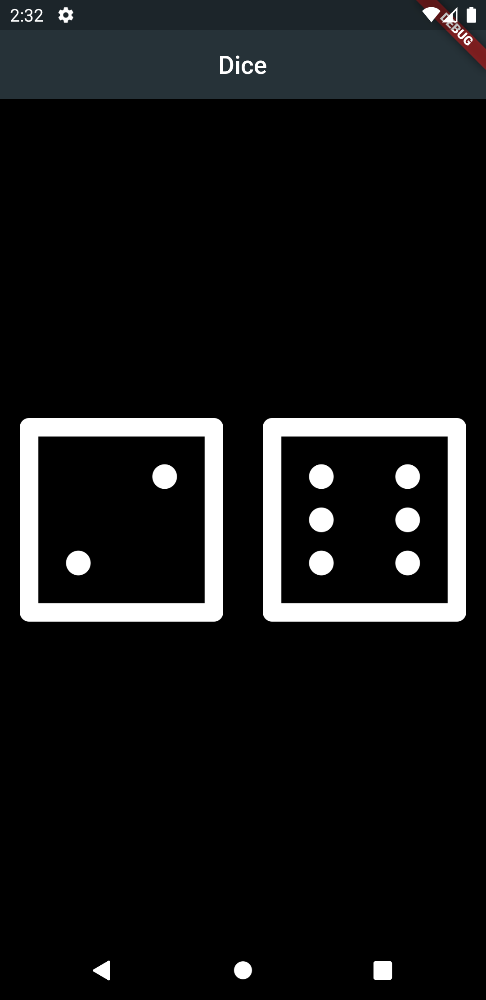

# Dice

A Flutter project for rolling the dices virtually.

 

  

 

## Getting Started

A few resources to get you started:

- [Lab: Write your first Flutter app](https://flutter.dev/docs/get-started/codelab)
- [Cookbook: Useful Flutter samples](https://flutter.dev/docs/cookbook)
- [Section 7: Dicee - Building Apps with State](https://github.com/londonappbrewery/Flutter-Course-Resources#section-7-dicee---building-apps-with-state)
